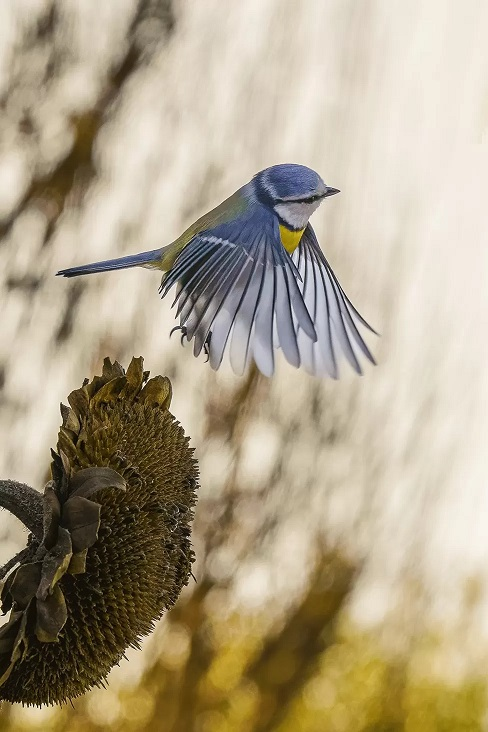

## \[2023.02.06 - Exp. GPT-Final\] 

#### Results
We got 38 winners out of a total pool of 281 participants.  
That's still a bit too many to digest for three days of news.
Let's chop down some more:  

```
Select 7 headlines from the following list that you believe would be most relevant to my interests as a philosopher, scientist, and connoisseur of human nature:   
<List of 38 winners>
```
ChatGPT output:  

[The Sunday Read: 'The Man Who Made Spain the Magic Capital of the World](https://www.nytimes.com/2023/02/05/podcasts/the-daily/juan-tamariz-magic.html)  
[In the Age of A.I., Major in Being Human](https://www.nytimes.com/2023/02/02/opinion/ai-human-education.html)  
[Spain, Morocco seek reset of testy relationship at Rabat summit](https://www.aljazeera.com/news/2023/2/2/spain-morocco-seek-reset-of-testy-relationship-at-rabat-summit)  
[Translating Kafka’s Diaries Reveals a New Side of the Writer](https://www.nytimes.com/2023/02/02/opinion/translating-franz-kafka-diaries.html)  
[How beavers are reviving wetlands](https://news.yahoo.com/beavers-reviving-wetlands-095056398.html?guccounter=1)  
[Ian Roberts: The double life and singular purpose of a rugby league legend](https://www.bbc.com/sport/64484125)  
[International Garden Photographer of the Year competition 2023](https://www.bbc.com/news/in-pictures-64472234)    


I read each one of the super-winners and I found the average quality pretty good, and while I didn't read any non-winners, I assume the super-winners were all better specimens than: "Australia’s central bank says it will remove the British monarchy from its bank notes" or "Tom Brady’s Last Season Didn’t Go as Planned. Was It Worth It?"  
More work is needed to produce better super-winners relevant to a specific user, since only the Kafka one was an actual interest of mine.   
I guess I would have preferred to get the Omar Apollo one, the American veterans that imploded and the Bon Voyage, Boeing 747.

What does this Experiment tell us? Well for starters that we get too many damn news, and most of them are crap too.  
Our typical approach is to sift through the headlines trash bin every day, skim most titles and read what's interesting for us.  
Now we got some stinkin' machines that can do that for us, but at what cost? Are we selling out our god given trash diving rights to the machines?   
We'll see.   
In the meantime look at this absolute stunner from the [International Garden Photographer of the Year competition 2023](https://www.bbc.com/news/in-pictures-64472234)  
<br/>



